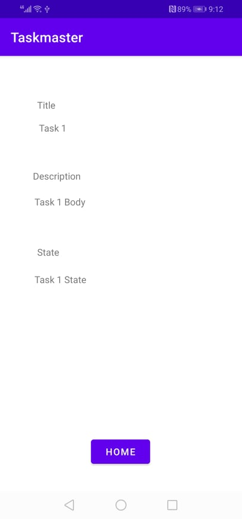
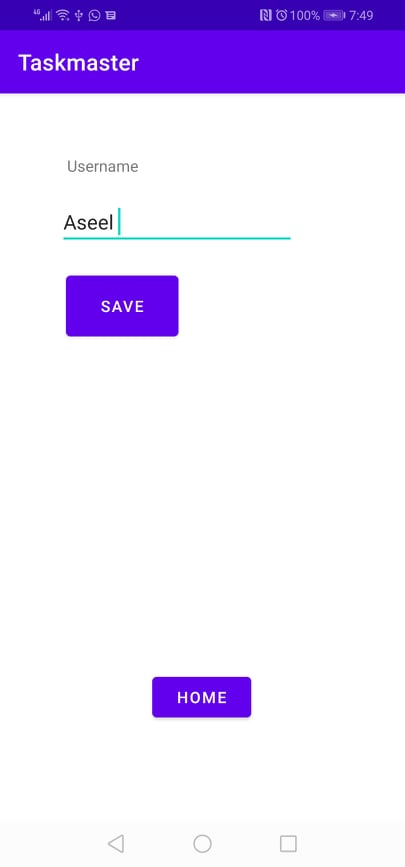

# taskmaster

## Feature Tasks

**Homepage**

The homepage also contain a button to visit the Settings page, and once the user has entered their username, it displays “{username}’s tasks” above the three task buttons.

homepage uses a RecyclerView display all Task entities in your database.

**Add a Task**

On the “Add a Task” page, allow users to type in details about a new task, specifically a title, state and a body. When users click the “submit” button, show a “submitted!” label on the page and save the data entered in as a Task in local database.

**Task Detail Page**

have a title the description and status of a tapped task are also displayed on the detail page.

<!-- Canceled Feature -->

<!-- **All Tasks**

The all tasks page is an image with a back button.

**Settings Page**

allow users to enter their username and hit save.

 -->
