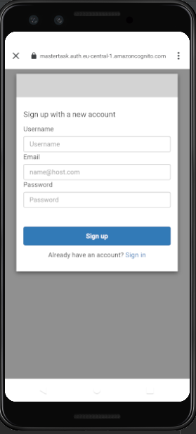
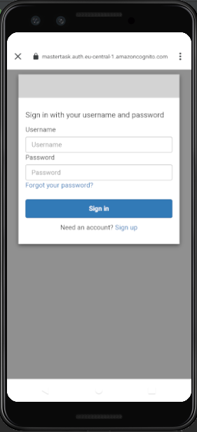
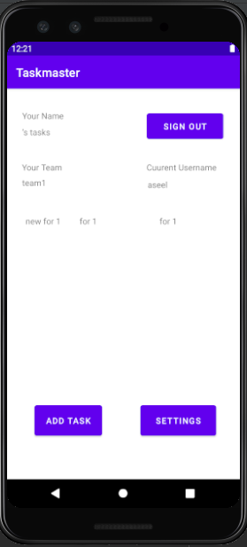
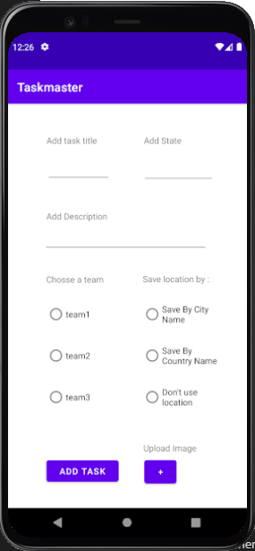
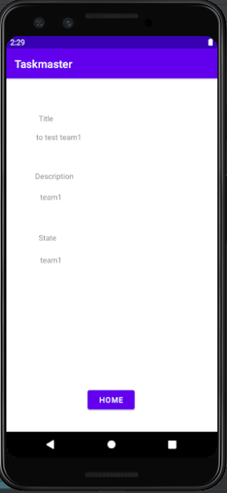
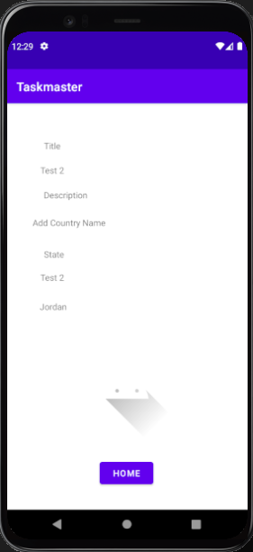
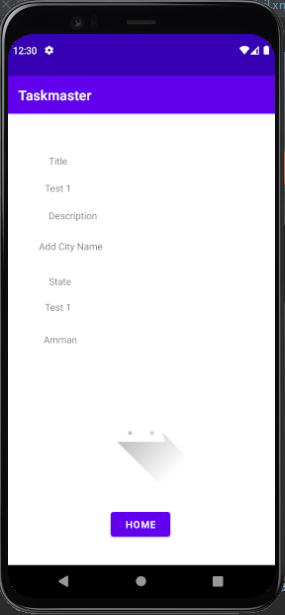
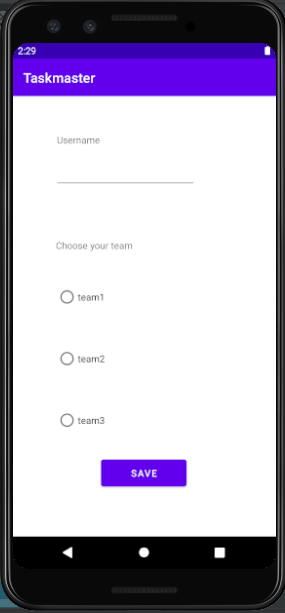
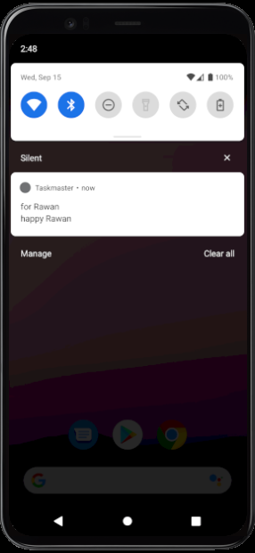

# taskmaster

## Feature Tasks

**SignUp and SignIn**

user login and sign up flows to the application, using Cognito’s pre-built UI as appropriate.

 

**Homepage**

homepage uses a RecyclerView display teams Task entities in DynamoDB.

also contain a button to visit the Settings page, and once the user has entered their username and there team, it displays “{username}’s tasks” and team name at the head of the page. also Display the logged in user. and sigh out button.

**Add a Task**

On the “Add a Task” page, allow users to type in details about a new task, specifically a title, state and a body.
and choose their team. When users click the “submit” button, task saved to DynamoDB.

users optionally can select a file to attach to that task. If a user attaches a file to a task, that file uploaded to S3, and associated with that task.

When the user adds a task, their location retrieved and included as part of the saved Task. the user can choose how specific of a location is saved: city, state, or country.

**Task Detail Page**

have a title the description and status of a tapped task are also displayed on the detail page. when the user click the task in the home page it redirect to this page.

if there is a file that is an image associated with a particular Task, that image displayed within that activity.

the location of a Task displayed if it exists.

  

**Settings Page**

allow users to enter their username and choose their team to display in the home page.

**Notifications**

the ability for push notifications to be delivered to the app from the cloud.

